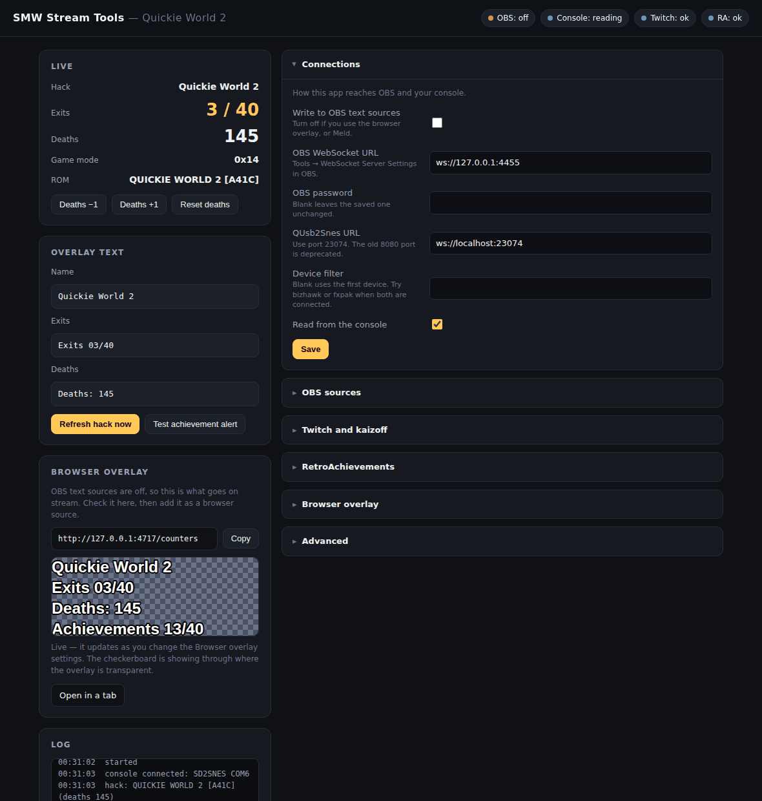
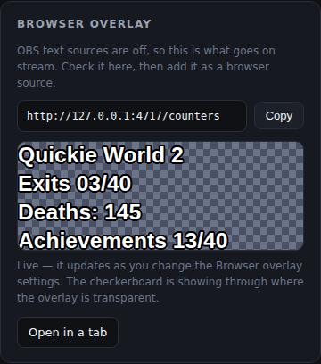
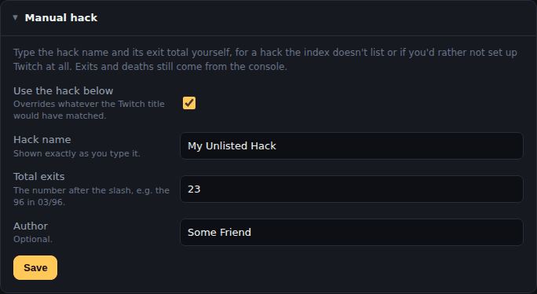
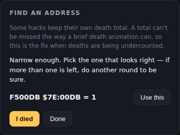

# SMW Stream Tools

Overlay automation for Super Mario World romhack streams. One app, running in the background, keeping your stream overlay up to date:

- **Hack name and exit total** — read from your Twitch stream title, matched against the [kaizoff.com](https://kaizoff.com) romhack index
- **Exits and deaths** — read live out of SNES memory, on real hardware or in an emulator
- **RetroAchievements** — progress readout, plus an on-screen alert when you unlock something



**Two ways to put it on screen.** Write to OBS text sources over obs-websocket, or point a single **browser source** at the overlay this app serves. The browser overlay is the newer route and generally the better one: it is one layer instead of several, it lays itself out, and the achievements line appears only for hacks that actually have achievements. It also works in **Meld Studio**, which has no way to set text from outside — see [Using Meld Studio](#using-meld-studio).

Either way there is no Python to install inside OBS, which was historically the hardest part of setting this kind of thing up and worst on macOS.

## Why read memory instead of watching the screen

Exits come from the game's own counter. That matters because the hack decides what counts as an exit: switch palaces that aren't meant to count, bonus levels, keyhole and orb exits that never show a COURSE CLEAR banner. Reading the counter gets all of that right without maintaining a list of special cases.

Deaths come from SMW's sprite-lock byte, which holds a distinct value during a death and different values again for pipes and doors — so entering a sublevel never looks like dying. Hacks with a custom retry patch clear it too fast to rely on, and [one button](#when-deaths-arent-counting-right) teaches the app where those hacks keep their own death total.

## What you need

| | |
|---|---|
| **Streaming software** | OBS 28 or later, or [Meld Studio](https://meldstudio.co) — anything with a browser source works |
| **Python** | 3.8 or later, unless you use the executable |
| **QUsb2Snes** | [QUsb2Snes](https://skarsnik.github.io/QUsb2snes/), for the exit and death counters |
| **RA2Snes** | [RA2Snes](https://github.com/Factor-64/RA2Snes), for Retro Achievements |
| **Hardware or emulator** | FXPak Pro / sd2snes over USB, or BizHawk / snes9x-rr / RetroArch |

Nothing else is required. The console side is optional, and so are Twitch and RetroAchievements — each part works without the others. obs-websocket is needed only if you write to OBS text sources; the browser overlay doesn't use it.

## Setup

## The executable

Most people who want this don't have Python, so each release carries a prebuilt
**`SMW Stream Tools.exe`** — a single file that needs nothing installed. Grab it
from [Releases](../../releases) and skip the setup steps below; the app still
opens the same settings page in your browser.

Settings go in a `data` folder beside the exe, so they survive updates. Keep
that folder when you replace the executable.


If you want to build from source instead of just running the executable then follow the steps below.

**1. Install the one dependency and start the app.**

```
pip install -r requirements.txt
python run.py
```

On Windows you can double-click `start.bat`, or build the executable described below. The app opens `http://127.0.0.1:4599` in your browser; that page is where everything is configured.

**2. Start QUsb2Snes,** then plug in the FXPak or start your emulator's connector. The URL is `ws://localhost:23074`. Leave Device filter blank unless hardware and an emulator are both connected, in which case type `fxpak` or `bizhawk`.

**3. Choose how it appears on stream.** One or the other, not both:

- **A browser source** — add one pointing at `http://127.0.0.1:4599/counters`, and untick **Write to OBS text sources** in Connections. This is the only route for Meld. See [The browser overlay](#the-browser-overlay).
- **OBS text sources** — enable OBS's WebSocket server under Tools → WebSocket Server Settings, tick Enable, and use Show Connect Info for the port and password. Put those in Connections; the OBS pill turns green and the dropdowns fill with your text sources. Leave any source blank to skip it — no deaths source means no deaths on screen.

**4. Optional: Twitch and RetroAchievements.** Both have their own sections below.

### Building it yourself

```
build.bat
```

It installs what it needs, builds, and leaves **`SMW Stream Tools.exe`** in the project folder. The `build` and `dist` folders are cleaned up afterwards.

The build is windowed, meaning no console, so if it fails to start there's nowhere for an error to appear — it writes `startup-error.txt` next to the exe instead. If it starts but you get no tray icon, open the settings page: the log says why.

On macOS or Linux, run the same PyInstaller command by hand with `:` instead of `;` in `--add-data`.

## The browser overlay

Instead of wiring up separate OBS text sources, you can point a single **browser source** at:

```
http://127.0.0.1:4599/counters
```

One layer carries the hack name, exits, deaths, author and achievements. It updates itself once a second, needs no obs-websocket connection, and works in anything with a browser layer — OBS, Meld, Streamlabs.

**This is the only route for Meld.** Meld doesn't speak obs-websocket; it has its own API, and that API has no way to set the text of a layer. A browser source sidesteps the problem entirely.

### The achievements line looks after itself

Most romhacks have no RetroAchievements set, and you don't want a dead `Achievements 0/0` sitting on screen all stream. So the overlay decides for itself: the line appears only when the hack you're playing actually has a set, and disappears when it doesn't.

That happens live. Switch mid-stream from a hack with no set to one that has them and the line fades in within a second; switch back and it fades out, with the rest of the overlay closing the gap. There is nothing to toggle in OBS or Meld, and nothing to remember before going live.

The same applies to everything else: a row with no content doesn't reserve space. No hack matched yet means no name line, and the console being unplugged means no exits line, rather than an empty box where they'd go.



### Checking it before you wire it up

Untick **Write to OBS text sources** in Connections and a **Browser overlay** card appears on the dashboard, showing the URL and a live preview of exactly what will go on stream. It updates as you change the Browser overlay settings, so you can get the font, colour and width right there and only then add the source.

The preview sits on a checkerboard, which is also the quickest way to confirm the overlay is transparent — anywhere you can see the checks through it is transparent on stream.

### Setting it up

Add a browser source, set the URL above, and size it to match **Width** in the settings. Height just needs to be enough for the rows you've enabled. Tick "Shutdown source when not visible" so it stops polling when the scene isn't live.

The **Browser overlay** section of the settings page controls which rows appear and how they look: font, size, colour, outline, alignment, and whether everything stacks or the counters share one line under the name. The text itself uses the same format strings as the OBS sources, so `Exits {done}/{total}` and friends work exactly as they do there.

**Each line can have its own size.** **Font size** sets the whole block, and the per-line boxes below it — hack name, exits, deaths, achievements, author — override it individually. Leave one at `0` to use the block size, so making just the hack name bigger means filling in one box, not five.

The author line is off by default and sits directly under the hack name, since that is what it credits. Ticking **Show author** both displays it and starts fetching it from kaizoff, which costs one extra request per hack.

Long names shrink to fit the width on their own, and wrap only if they'd fall below **Minimum font size** — the same order the OBS path uses, but done natively by the browser, so it needs no round trips and no font files.

### Using it alongside text sources

The two are independent: if a text source is still configured, it keeps being written whether or not the overlay is showing the same thing. Pick one. If you move to the browser overlay, clear the source names in Sources so nothing is written twice.

The achievement **unlock alert** at `/overlay` is separate and unaffected — it's a popup card, not a counter, so it stays its own browser source.

## Using Meld Studio

Meld works, through the browser overlay. There is nothing else to install and no bridge to run.

**1. Turn off the OBS side.** In Connections, untick **Write to OBS text sources**. Otherwise the app spends the whole stream retrying a connection that will never exist, and shows red in the tray for a problem you don't have.

**2. Check the overlay.** A **Browser overlay** card appears on the dashboard with a live preview and the URL. Get it looking right there first — it renders the same in Meld as it does in the preview.

**3. Add the layer.** In Meld's **Layers** panel, click **╋**, choose **Browser**, and put this in the **URL** field in the Inspector:

```
http://127.0.0.1:4599/counters
```

**4. Size and place it.** Resize the layer to suit your scene, and set **Width** in the Browser overlay settings to match — that width is what the text fits itself to. Leave the layer non-interactive; the pointer icon is for pages you click on, and this one you only look at.

**5. For achievement alerts,** tick **Show unlock alerts** under RetroAchievements, then add a second Browser layer pointing at the URL the dashboard shows — 

```
http://127.0.0.1:4599/overlay
````
set it around 900×300.

## Typing the hack in yourself

Exits and deaths come from the console and always will — the console is the only thing that knows them. What has to come from somewhere else is the hack's **name** and its **exit total**, and no index knows about every hack.

The **Manual hack** section of the settings page takes both. Tick **Use the hack below**, type a name and a total, and that is what goes on screen: `Exits 07/23`, with the 7 still climbing from the console as you clear levels. There's an optional author field too.



Reach for it when:

- the hack isn't in the kaizoff index at all
- the matcher refuses your title, usually a sequel it can't tell from the original
- you'd rather not register a Twitch application — **Twitch is optional**, and this is how the name and total get filled in without it

Untick it and the next poll goes back to matching your stream title, with no waiting for the title to change. Leaving the name blank counts as not overriding, so it falls back the same way.

While the override is on, the app stops polling Twitch entirely — there's no point spending requests on an answer it would discard.

## Twitch: where the hack name comes from

The app doesn't know which hack you're playing, and there's nothing in SNES memory that reliably says. What it does instead is read your **stream title**, match it against the [kaizoff.com](https://kaizoff.com) romhack index, and get back the hack's proper name, its total exit count and its author.

That's what makes `Exits 03/96` possible — the console supplies the 3, kaizoff supplies the 96. Without either Twitch or a manual entry you still get deaths counting up, but nothing knows what the exits are out of, so that line stays empty.

This is optional — [type the hack in yourself](#typing-the-hack-in-yourself) if you'd rather skip it. Reading a stream title is public information, but Twitch still requires an application to ask for it. You are not logging in or authorising anything, and the app never gets access to your account — it identifies itself as an application and reads the same title anyone can see on your channel page.

### Getting a Client ID and Client Secret

**Two-factor authentication must be on** for your Twitch account before the developer console will let you register anything. If you don't already have it, turn it on under Security and Privacy in your Twitch settings first.

1. Go to [dev.twitch.tv/console/apps](https://dev.twitch.tv/console/apps) and sign in.
2. **Register Your Application.**
3. **Name** — must be unique across all of Twitch, so put your channel name in it. `l337f00l-stream-tools` rather than `stream tools`.
4. **OAuth Redirect URL** — `http://localhost`. The field is required but this app never uses it, because no browser redirect is involved.
5. **Category** — Application Integration.
6. Create, then **Manage** the app you just made.
7. Copy the **Client ID**.
8. Click **New Secret**, confirm, and copy the secret **straight away** — it is shown once and never again. If you lose it, generate another; the old one stops working.

Paste both into the app's Twitch section along with your channel name (just the name, not the URL), and save.

### Making titles match

The matcher looks for a hack name inside your title, so `Kaizo Mario — Grand Poo World 2 — !commands` works fine. Two things to know:

- If nothing matches, the log says so, and the app deliberately shows nothing rather than guessing. Sequels are the usual cause — it refuses `Grand Poo World 3` rather than falling back to `Grand Poo World`, because showing the wrong exit total is worse than showing none.
- Anything it can't work out on its own goes in `data/overrides.json`, described under Overrides below.

### Keeping the secret safe

The Client Secret is stored in `data/config.json` in plain text, the same way OBS stores its own. The settings page never shows it back to you once saved — it only reports that one is set — and `data/` is excluded from git so it can't be committed by accident. Treat it like a password: it identifies your application, so don't paste it into a screenshot or an on-stream browser source.

## RetroAchievements

Optional, and worth understanding before you wire it up.

**Most romhacks do not have achievement sets.** RetroAchievements sets are made by hand, and the overwhelming majority of them are for retail games. A handful of hacks have them — [Quickie World](https://retroachievements.org/game/8476) is one — but for most of what a kaizo stream plays, there is simply nothing to show.

So if you turn this on and the text source stays empty, **nothing is broken**. It means the hack you're playing has no set.

If you use the browser overlay described below, this handles itself — the achievements line only appears for hacks that have achievements, and comes and goes as you switch. With OBS text sources you hide that source yourself for those streams, or leave RetroAchievements switched off entirely, which is the default.

### What you need

1. Your **RetroAchievements username**.
2. A **Web API key**, from your [control panel](https://retroachievements.org/controlpanel.php) — find the **Keys** section and copy the web API key. It is not your password, but treat it like one.

Paste both into the RetroAchievements section and save. Leave **Game ID** blank to follow whatever you're currently playing, or set it to pin one game.

**How "follow whatever you're playing" knows when you switch.** It asks RetroAchievements what you played most recently — and RA only knows about games it recognises. Load a hack with no achievement set and RA never hears about it, so on its own it would keep reporting the *previous* hack indefinitely.

The console is what resolves this: it reports the moment the ROM changes, which RA cannot see. The readout drops at that point and comes back only once RA shows it is tracking the new hack. So leave the console side enabled if you switch hacks mid-stream. If you run without a console, pin a **Game ID** instead, which is always trusted.

### Something has to award the achievements

This app only *reads* retroachievements.org. It doesn't detect unlocks itself, so something else has to be earning them:

- **On an emulator** — RetroArch or RALibretro with RetroAchievements enabled.

If nothing is awarding achievements, the readout will correctly show that you have none.

### The unlock overlay

With **Show unlock alerts** ticked, an **Achievement alerts** card appears on the dashboard with the URL and a copy button. Add a browser source pointing at it:

```
http://127.0.0.1:4599/overlay
```

Around 900×300, positioned where you want the card. **Alert corner** decides which corner of the browser source it sits in. Tick "Shutdown source when not visible" so it stops polling when the scene isn't live. The **Test achievement alert** button lets you place it without earning anything.

**Alert check interval** is the delay between unlocking something and it appearing on stream, because the app finds out by asking the website. Ten seconds is a reasonable balance; the progress text updates itself as soon as an unlock is spotted rather than waiting for its own slower poll.

## Running alongside RA2Snes

This works. RA2Snes needs QUsb2Snes, and QUsb2Snes serves both it and this app from the same pak at once — sharing one device between applications is what a usb2snes server is for.

Run QUsb2Snes and RA2Snes as you normally would, and point this app at:

```
ws://localhost:23074
```

**Use 23074, not 8080.** The old 8080 port is the one thing that trips this up — QUsb2Snes disabled it by default in v0.7.34.1 — and a leftover `8080` is the most likely reason the console pill sits on "reconnecting".

Only one program can hold the USB port, so don't run another usb2snes server at the same time.

## How the pieces fit

The hack name, exit total and author come from kaizoff. The completed exit count and deaths come from the console. One writer combines them, which is the main reason these used to be separate scripts and now aren't — previously two scripts wrote to the same exits source and fought over it.

When the console isn't connected, the exit count falls back to the per-hack number saved on disk, so the text stays sensible offline.

Hacks are identified by their ROM header — internal title **and** checksum. The title alone isn't enough: most hacks are patches over Super Mario World and never change it, so two different hacks usually both report `SUPER MARIO WORLD`. Exit and death counts are saved per hack, so switching away and back restores them.

## Settings that matter

Most defaults are fine. These are the ones worth knowing about:

| Setting | Default | Why you'd change it |
|---|---|---|
| Write to OBS text sources | on | Turn off if you use the browser overlay, or Meld |
| Use the hack below | off | Type the hack name and exit total instead of matching a Twitch title |
| Device filter | blank | Set to `fxpak` or `bizhawk` when both are connected |
| Exits format | `Exits {done}/{total}` | `{done} {total} {name} {author} {deaths}` all work |
| Arm after N seconds | `10` | How long before trusting readings on a hack with no overworld |
| Alert check interval | `10` | This is the delay you see on stream when an achievement unlocks |
| Death detection | state | Don't set this by hand — **Find the death counter** switches it when a hack needs it |
| Death address | `F5009D` | Only if a hack behaves oddly — see the scan tools |

## Troubleshooting

**Check the log panel first.** The app says what it's doing: which hack it matched, what it wrote, why it can't connect.

**OBS won't connect.** The status text names the cause. A wrong password shows as OBS closing the connection; OBS not running shows as unreachable. If you use the browser overlay and don't want OBS at all, untick **Write to OBS text sources** — otherwise it retries forever and shows red in the tray for a problem you don't have.

**The browser overlay is blank.** Open `http://127.0.0.1:4599/counters` in a normal browser tab: if it works there, the app is fine and the problem is the source in your streaming software. If a row is missing, it has nothing to show — no hack matched yet, no console connected, or, for achievements, a hack with no set.

**The source dropdowns are empty.** OBS isn't connected yet, or your text sources use an input kind the filter doesn't recognise. The fields are editable — type the source name exactly as it appears in OBS.

**Deaths or exits don't move.** Look at the Console pill. `waiting to arm` means it hasn't seen a file load yet; it arms by itself after ten seconds of play. `no file loaded` means the game mode says you're on a title or menu screen.

**The console keeps disconnecting.** The log names the reason each time — `console disconnected: …` — and that reason is the diagnosis. Reconnecting is also how the app resynchronises after a bad read, so the odd drop is normal and costs nothing; a constant cycle is not.

**"attached but not answering", on a loop.** The device list works and reads never come back. Check the URL first — it should be `ws://localhost:23074`, and a leftover `8080` produces exactly this. Failing that, close any other copy of this app.

**Everything reads as `0x55`.** Memory isn't being exposed. On an emulator that's usually the wrong core — the connector reads BizHawk's System Bus domain, which the Snes9x core doesn't expose, so switch to BSNES. On hardware it means the ROM uses an enhancement chip the pak can't mirror.

**SA-1 hacks aren't supported.** The FXPak can't expose their memory at all, and under emulation SA-1 relocates SMW's variables so the stock addresses don't apply. The hack name and exit total still work; count exits by hand.

**No hack matched.** The log says why. If the title contains a sequel name the index doesn't carry, the matcher deliberately refuses rather than showing the base game's exit count — map it in `data/overrides.json`, or just type the name and total into **Manual hack**.

**Deaths are wrong — missed, doubled, or counting pipes.** Every symptom and its fix is in [When deaths aren't counting right](#when-deaths-arent-counting-right).

**The achievement text is empty.** Almost always because the hack has no achievement set. See RetroAchievements above.

## Overrides

`data/overrides.json` has two sections:

```json
{
  "display": { "Tortured Souls 2": "TS2" },
  "match":   { "ts2": "Tortured Souls 2" }
}
```

`display` forces a short form on stream. `match` maps a keyword in your title to an exact index name, for anything the matcher won't find on its own.

## Fitting long names (OBS text sources)

This is about the OBS text-source path; the browser overlay does its own fitting in CSS.

Hack names vary wildly in length, so the name source is fitted to a maximum width rather than left to overflow. In order: drop a trailing `: Subtitle` if there is one, then step the font size down, then wrap to two lines at full size.

The relevant settings are **Max name width**, **Base font size** and **Minimum font size**, under Advanced.

The exits source can follow the name automatically. **Exits placement** offers:

- **below** — under the name, moving down on its own when a long name wraps
- **right** — after the name on the same line
- **off** — never touch the scene; you place both sources yourself

Placement respects each source's own anchoring, so a right-anchored overlay stays flush right, a left-anchored one stays flush left, and a centred one stays centred. Width is measured by asking OBS, so it is right for whatever font, style and scale your source actually uses — nothing needs to know about font files.

Fitting only runs when the hack name changes, not on every exit or death update.

## Running it in the tray

With `pystray` and `Pillow` installed (both are in `requirements.txt`), the app sits in the system tray instead of holding a console window. The icon colour is the status at a glance:

| | |
|---|---|
| 🟢 green | everything you've enabled is working |
| 🟡 amber | something is still connecting — usually the console |
| 🔴 red | OBS is unreachable, so nothing is being written |

Hover for the detail: current hack, and a line per connection. Click to open the settings page, right-click to quit.

Anything you've switched off is ignored, so leaving RetroAchievements disabled never shows a warning. Run with `--no-tray` to force the console instead, or `--no-browser` to stop it opening the settings page at startup.

**No icon appearing?** The app keeps running without one, and the reason is in the log on the settings page — usually that `pystray` and `Pillow` aren't installed. On Windows the icon starts in the hidden-items overflow; drag it onto the taskbar to pin it there.

## When deaths aren't counting right

Deaths are the one thing the game doesn't count for you. There's no death total sitting in memory the way there is for exits, so what gets read instead is a byte that means "the player is dying" — and hacks disagree about that byte more than about anything else in this app.

**Most hacks need nothing.** A hack built straight on Super Mario World leaves that byte where vanilla put it, the app samples it every 20 milliseconds while you're in a level, and deaths count correctly with no setup at all.

The hacks that need help are the ones with a custom retry patch. The prompt appears before the death animation really plays, so the byte is set and cleared in under two frames — 23 milliseconds, measured on hardware. Some of those hacks keep a death total of their own instead, somewhere else in memory entirely, and a total can't be missed the way a 23ms flicker can.

So if a hack is undercounting badly — you've died twenty times and it says four — that's the one to fix, and there's a button for it.

### The fix

About a minute, and you do it once per hack.

1. Load the hack and get into a level.
2. On the settings page, scroll to **Find an address** and click **Find the death counter**.
3. Die, let the retry finish, then click **I died**.
4. Repeat step 3 two or three more times. Each round discards every address that didn't behave like a counter, so the list shrinks quickly.
5. When one address is left, click **Use this**.



That's all of it. **Use this** fills in both the address and the detection mode together, which is the reason not to set either by hand — one without the other behaves exactly like the app being broken.

**It's remembered for that hack only.** The setting is filed against the loaded ROM, so returning to that hack later needs no action from you, and no other hack is touched. Hacks you haven't taught keep using the defaults. The **Find an address** card tells you when the loaded hack has an address of its own, with a button to drop back to the defaults if you set one by mistake.

That per-hack filing is also why the app doesn't simply watch both addresses at once. A counter address from one hack is arbitrary memory in another, and if it happened to tick you'd be shown deaths that never happened.

### If the finder comes up empty

Then the hack keeps no death total and there's nothing to find. Lower **Poll interval** under Advanced instead: at the default 200 a very brief death state is caught perhaps a fifth of the time, where 50 catches most of it. Below 50 the returns collapse, and it's 20 reads a second competing with anything else using the pak.

### Confirming a fix

However you fixed it, confirm it the same way, because the two mistakes look identical on a scoreboard and opposite in cause:

1. **Die once.** The number goes up by exactly one.
2. **Go through a pipe.** It does not move.
3. **Go through a door.** It does not move.

Pipes and doors are what break death counting, and they're the step people skip. A setting that counts deaths *and* doors looks fine for one level and then drifts all stream.

### Other symptoms

Check the Deaths number on the dashboard first, not the one on stream. If the dashboard is right and the overlay is wrong, the problem is the source, not the counting.

| What you see | What it usually is | What to do |
|---|---|---|
| No deaths at all, ever | **Death address** is empty, or the console never armed | Check the Console pill reads `reading`, and that **Death address** is `F5009D` |
| Goes up when you enter a pipe or a door | **Death state value** is wrong | It should be `30`. `04` is a pipe and `00` is a door — those are what it has to ignore |
| Goes up by two or three per death | The address holds the value in bursts | **Find the death counter**, which counts the hack's own total instead |
| Stuck at a number, nothing moves | Console disconnected, or waiting to arm | Console pill again — `waiting to arm` clears itself after ten seconds of play |
| Carried over from the hack before | The ROM identity didn't change | Counts are filed per hack by internal title **and** checksum. Two hacks sharing both share a count |
| Worked on one hack, stopped on the next | They detect deaths differently | Expected. Run **Find the death counter** once on the new hack; each hack keeps its own setting |
| Off by a few after testing | Nothing wrong — you earned some of those on purpose | **Deaths −1 / +1** on the dashboard nudges it back |

Resetting the console doesn't affect the count either way: the game-mode gate stops reading before the reset can look like a death.

### What the log tells you

The log on the settings page says more than the number does. Each death is recorded like this:

```
deaths = 3  (7 of 412 samples saw it)
```

The number in brackets is how many reads actually caught the death byte set. It separates the two faults that look the same from outside:

- **Deaths going up, samples seeing it** — working.
- **Samples seeing it, deaths not going up** — the byte is set but never clearing, so there's no edge to count. Wrong value for this hack.
- **Samples never seeing it** — the state is too brief to catch. Use the counter.

If a byte stays at the death value longer than any death animation could last, the log says so outright rather than leaving you to work it out:

```
death byte stuck at 0x30 — deaths after this will not count. Wrong value for this hack?
```

### Values are hex

**Death state value** and the address fields are hexadecimal. The death value is `30`, not `48` — `48` is the same number written in decimal, and pasting it means the comparison silently never matches and nothing is ever counted. This one cost hours during development, so it's worth saying plainly.

### Fixing the number live

**Deaths −1**, **Deaths +1** and **Reset deaths** on the dashboard adjust the count without restarting anything, and the change is saved for that hack. Useful when you've been testing, or when a drift crept in mid-stream and you'd rather correct it than explain it.

## Finding an address on an unusual hack

**Most people never need this.** The addresses in Settings were found and confirmed on hardware and hold for the large majority of hacks, because almost all of them are patches over Super Mario World that leave its variables where vanilla put them.

You need it when a hack doesn't play along — deaths being missed, or an exit count that never moves. There are two ways to find the right address: a button in the settings page, and the command-line tools.

### From the settings page

The **Find an address** card on the dashboard does this without any typing: play, press a button after each death or exit, and it narrows the possibilities each round. **Find the death counter** is the one most people want, and it's walked through step by step in [When deaths aren't counting right](#when-deaths-arent-counting-right). **Find the exit counter** works the same way for a hack whose exit count never moves — clear a level that should count, then press the button.

It reads through the connection the app already has, so it won't disturb the console or clash with RA2Snes. It also works from the executable, which the command-line tools can't.

### From the command line

The CLI tools cover more ground — including finding the *state* byte, which can't be driven by a button because you'd have to press at the exact frame it's on screen:

```
python run.py --help
```

### The tools

| | |
|---|---|
| `devices` | Lists what the server can see. Start here if the console won't connect at all — it tells you what to put in Device filter, and whether your emulator's connector is actually running. |
| `title` | Prints the ROM identity the app files your counts under. Use it to check two hacks really are distinguishable: the name is nearly always `SUPER MARIO WORLD`, so it's the bracketed checksum that does the work. |
| `scan` | Finds the exit counter. Clear a level that should count, press Enter, repeat. Usually down to one candidate after a single round. |
| `find-death` | Finds the byte that means "you are dying". Each round samples both alive and dying, so a candidate has to hold a value at every death that it never holds while alive. Two rounds is typical. |
| `find-death-counter` | Finds a byte that goes up by one per death. Some retry patches keep their own total. Use it when `find-death` keeps coming up empty. |
| `watch` | Prints one byte whenever it changes. This is the confirmation step, and the one worth not skipping. |
| `probe` | Shows the game mode next to a counter, for choosing the gate values that keep the title-screen demo from being read as progress. |
| `deaths` | Counts deaths as fast as the link allows and times how long each one lasts. Ground truth for death detection. |

### Finding the exit counter

```
python run.py scan
```

Clear a level that genuinely counts as an exit, press Enter, and repeat until it's down to one or two candidates. Then confirm before trusting it:

```
python run.py watch F51F2E
```

Clear another level and make sure it goes up by exactly one, then put the address in **Exit counter address**.

Re-clearing a level you've already beaten adds nothing, so if a round reports no candidates that's the first thing to check. A switch palace the hack doesn't count is also a normal no-op — that's the behaviour you're relying on, not a fault.

### Finding the death byte

```
python run.py find-death
```

Play for a few seconds and press Enter, then die and press Enter **while the death is still on screen**. Timing is what matters: on a quick-retry hack the state can be gone in a couple of frames.

Confirming this one matters more than confirming the exit counter, because pipes and doors are what break death counting. Watch the candidate, then go through a pipe and a door:

```
python run.py watch F5009D
```

If it only shows its value when you actually die, put it in **Death state address** and the value in **Death state value** — as hex, without the `0x`. `watch` prints both forms for exactly this reason; a decimal value pasted into a hex field silently never matches.

Then check it holds long enough to be seen:

```
python run.py deaths
```

If the shortest death is under your poll interval, that's why deaths go missing. Either lower **Poll interval**, or — better — switch to counting the hack's own total, which no poll interval can miss:

```
python run.py find-death-counter
```

Put what it finds in **Death address** and set **Death detection** to *A total the hack keeps*. **Death state value** is ignored in that mode.

Counter mode handles the awkward parts on its own: it syncs rather than crediting everything on the first read, it follows the byte rolling past 255, and a counter reset by a new save file doesn't add hundreds.

### Choosing gate values

```
python run.py probe F51F2E
```

Move between the title screen, file select, the overworld and a level, noting which mode values appear where. Modes at or above **Game mode minimum** are when the counter is trusted; **Arm modes** are the ones that prove a real save file is loaded. The defaults cover vanilla-based hacks; a hub-world hack with no overworld arms on the ten-second dwell instead.

## Credits

Hack data from [kaizoff.com](https://kaizoff.com). Console access via [QUsb2Snes](https://github.com/Skarsnik/QUsb2snes) by Skarsnik. Achievement data from [RetroAchievements](https://retroachievements.org).

## License

MIT — see [LICENSE](LICENSE).
